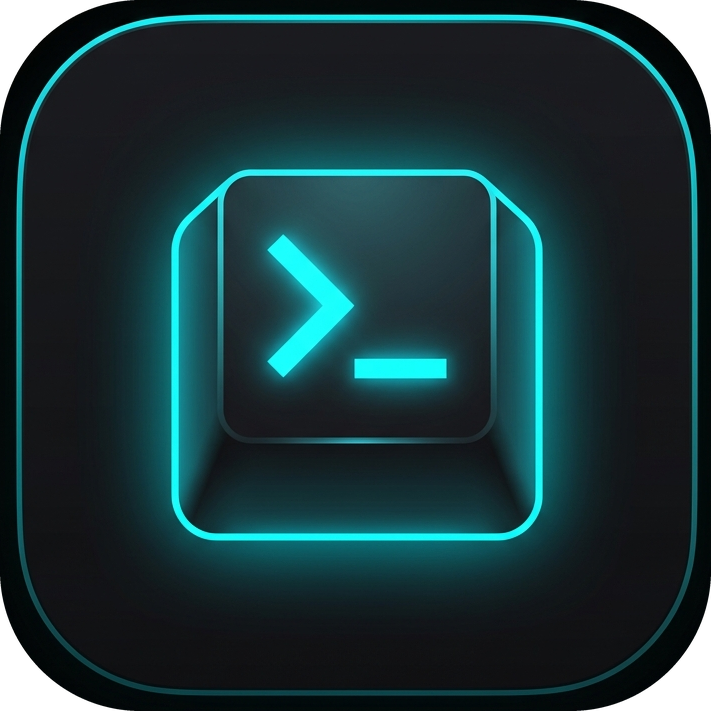
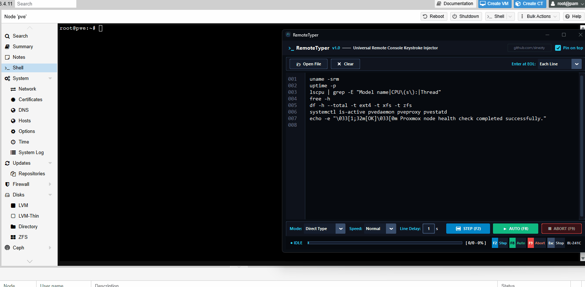

<p align="center">
  
</p>

<h1 align="center">RemoteTyper</h1>

<p align="center">
  <strong>Universal Remote Console Keystroke Injector for Sysadmins, DevOps & IT Engineers</strong>
</p>

<p align="center">
  <a href="https://python.org"></a>
  <a href="https://www.microsoft.com/windows"></a>
  <a href="https://github.com/sinezty/RemoteTyper/releases"></a>
  
  <a href="https://github.com/sinezty"></a>
</p>

<p align="center">
  <strong>🇬🇧 English Documentation</strong> &nbsp;•&nbsp;
  <a href="README_TR.md"><strong>🇹🇷 Türkçe Dokümantasyon</strong></a>
</p>

<p align="center">
  <em>Type text into remote consoles and virtual machines where OS clipboard paste is blocked or unavailable.</em>
</p>

<p align="center">
  
</p>

---

### 🎯 The Problem & The Solution

In many server administration scenarios, **copy-pasting text from your host into a remote console simply does not work**:
- Browser-based KVMs (such as **Proxmox VE noVNC**, **oVirt**, or **OpenStack**) intercept or disable clipboard APIs.
- Out-of-band management interfaces (**IPMI**, **iDRAC**, **iLO**, **KVM over IP**) run in isolated sandbox environments.
- Air-gapped networks, fresh OS installs, BIOS/UEFI shells, or hypervisors without guest tools block host-to-guest copy-paste.

**RemoteTyper** solves this completely by sending text character-by-character as **physical hardware keystrokes** using **Direct Keystroke simulation** or **ALT+Numpad ASCII injection**. Because the operating system receives genuine scan codes, the target console cannot distinguish it from a person typing on a real physical keyboard.

---

### ✨ Features

- **Step-by-Step (Line-by-Line) Execution (`F2`)**:
  - Types a single line, presses Enter (per Enter mode), and pauses.
  - Review the remote server's output and press `F2` again whenever you're ready for the next line!
- **Line Delay (Output Settling Pause)**:
  - Configurable delay (default `3s`) after each line so remote command outputs don't interleave with subsequent commands.
- **Auto Injection (`F8`)**:
  - Injects all lines automatically with a 5-second fixed countdown and the configured Line Delay between lines.
- **Dual Keystroke Injection Engines**:
  - **`Direct Type` (Default)**: Fast, rock-solid keyboard event simulation tailored for Proxmox noVNC, web consoles, and VMs.
  - **`ALT+Numpad` (Universal)**: Emulates hardware ALT+Numpad code injection (`Alt + 0 + X + X + X`) for legacy IPMI/iDRAC consoles.
- **Smart End-of-Line (Enter) Control**:
  - **`Each Line`**: Automatically presses Enter after each line.
  - **`Except Last` (Safety Mode)**: Types all lines and presses Enter between them, but stops on the final line without executing — allowing you to review critical commands (`rm`, `dd`, `reboot`, config updates) before running them.
  - **`Disabled`**: Never presses Enter (types continuous text).
- **Auto Smart-Quote & Dash Sanitizer**:
  - Web blogs and documentation sites often replace standard quotes with curly quotes (`“ ” ‘ ’`) or typographic dashes (`— –`). RemoteTyper automatically sanitizes them into ASCII bash/shell compatible equivalents before typing.
- **Hardware-Level Key Safety**:
  - Guaranteed `try...finally` safety lock release ensures that modifier keys (ALT, Shift, Ctrl) never get stuck down on your operating system if stopped mid-injection.
- **Ultra-Compact TUI/Console Aesthetics**:
  - Streamlined 2-line bottom control deck maximizing text editor screen space.
  - InnoSetup-style embedded progress bar, live completion percentage, and character counter.
  - High-contrast, sharp Segoe UI & Consolas typography on a dark terminal palette.
- **Global Hotkeys**:
  - **`F2`**: Step single line and wait.
  - **`F8`**: Start auto injection (5s countdown).
  - **`F9`**: Emergency instant abort (stops typing immediately, even when minimized).
  - **`Escape`**: Cancel typing when focused.
- **Pin on Top**: Toggle always-on-top so the utility stays floating above your remote console window.
- **File Loader**: Open `.txt`, `.sh`, `.bat`, `.conf`, `.yaml`, `.ps1`, etc.

---

### 🚀 Quick Start

#### Option 1: Download Standalone EXE (Recommended)
No Python installation required.
1. Download **`RemoteTyper.exe`** from [Releases](https://github.com/sinezty/RemoteTyper/releases).
2. Run `RemoteTyper.exe`.

#### Option 2: Run from Source
```bash
# Clone the repository
git clone https://github.com/sinezty/RemoteTyper.git
cd RemoteTyper

# Install dependencies
pip install -r requirements.txt

# Run the app
python remotetyper.py

# Optional: Run with debug logging to remotetyper_debug.log
python remotetyper.py --debug
```

---

### 🎮 How to Use

1. Paste your script or commands into the editor.
2. Choose your **Mode** (`Direct Type` for Proxmox/noVNC/VMs, `ALT+Numpad` for IPMI/iDRAC).
3. Set your **Speed** (`Normal`, `Slow`, `Fast`) and **Line Delay** (e.g. `3s`).
4. Choose your **Enter at EOL** option (`Each Line`, `Except Last`, or `Disabled`).
5. Choose execution style:
   - **Step-by-Step (`F2`)**: Press **`F2`** or click **[ ⏭ STEP (F2) ]** to send one line at a time.
   - **Auto Mode (`F8`)**: Click **▶ AUTO (F8)** or press **`F8`** for full automatic run (5-second countdown to switch to remote window).
6. Press **`F9`** anytime to immediately halt typing.

| Hotkey | Action | Description |
|:---:|:---:|---|
| **`F2`** | **Step** | Injects single line, presses Enter, and waits for next press |
| **`F8`** | **Auto** | 5s countdown, then injects all lines with Line Delay |
| **`F9`** | **Abort** | Emergency stop — halts injection immediately |
| **`Escape`** | **Stop** | Stops typing when window is focused |
| **`Ctrl + A`** | **Select All** | Selects all text inside the buffer |

---

### ❓ FAQ & Troubleshooting

#### Why did Windows SmartScreen show "Windows protected your PC"?
Windows SmartScreen displays an alert for freshly compiled executables downloaded from the internet that do not have an expensive commercial code-signing certificate.
- Click **"More info"** → **"Run anyway"**.
- RemoteTyper is 100% open-source; you can inspect the full code in [`remotetyper.py`](remotetyper.py) or compile the EXE on your own machine.

#### Keystrokes are not appearing in the target window?
1. **Run as Administrator**: If your target application (PowerShell as Admin, VNC client, or VMware Workstation) is running with elevated privileges, Windows prevents standard non-elevated apps from injecting keystrokes into it. Simply launch `RemoteTyper.exe` by right-clicking and choosing **Run as administrator**.
2. **Web Consoles (Proxmox noVNC)**: Use **`Direct Type`** mode (default) with **`Normal`** or **`Slow`** speed for maximum WebSocket stability.

---

## 📄 License

Distributed under the **MIT License**.

Developed with passion by **[@sinezty](https://github.com/sinezty)**
